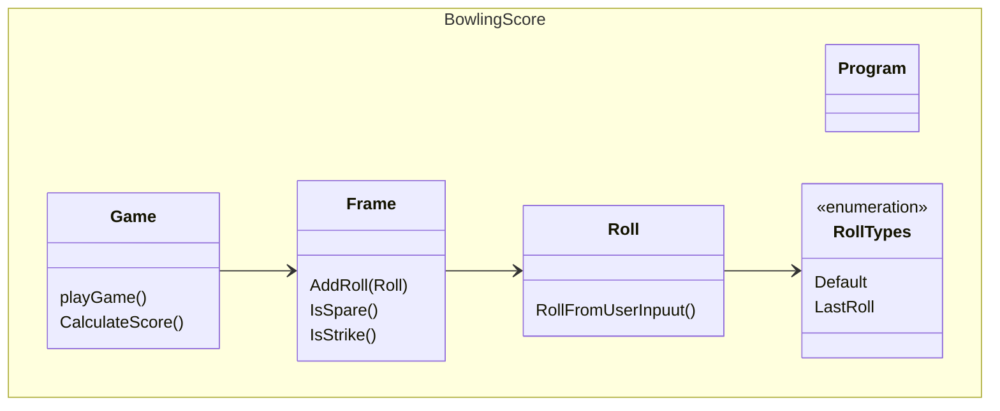

# BowlingScore

This project implements a system to calculate the score of a game of bowling. Below is a class diagram of the most important parts of the program. 

The main 3 objects are the Game, the frame and the roll. 
Each of these objects are responsible for functions related only to themselves
Game - this object runs the game and thus keeps track of rules and score

Frame - has the roll for the frame and the methods to see if the frame is a spare or strike
One could argue for a subclass called "FinalFrame" to handle the last frame of the game, as this frame acts slightly different than other frames. However the main difference is really in how the score is calculated and the allowed bonus roll, and therefor I have this implementation in the Game object instead. After having written the CalculateScore method, which is admittedly not the prettiest, I would consider changes to handle the final frame differently - such as by inheritance.

Roll - This class just has the number of knocked pin for each roll and some logic to ensure that the number input is valid. Here I used enum types to allow for the "Final roll", to ensure that a bonus roll would be allowed in the frames, that normally only allow for 2 rolls. 

Lastly there is a program.cs to let you run the game and I implemeted some tests to make testing of my calculation method easier on myself. 

